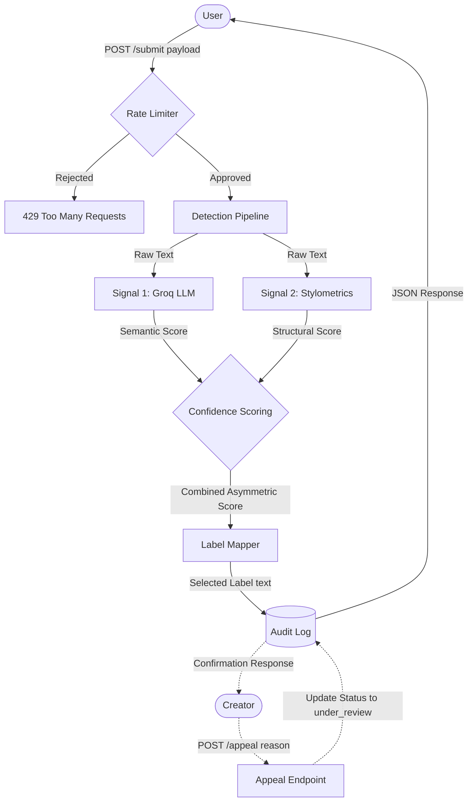

# Provenance Guard Project Planning

## 1. System Overview
This is a backend API designed to classify text submissions as AI or Human, score confidence, surface a transparency label, and handle creator appeals. It prioritizes creator trust by embracing uncertainty rather than forcing inaccurate binary verdicts.

## 2. Detection Signals
**Signal 1: Semantic Coherence (Groq LLM)**
This signal measures holistic semantic flow, narrative cohesion, and stylistic predictability. It leverages the fact that LLMs predict the most probable next token, making AI text highly cohesive. The output is a float between `0.0` (confident human) and `1.0` (confident AI).

**Signal 2: Stylometric Heuristics (Python)**
This signal measures structural variance, specifically sentence length variation (burstiness) and vocabulary diversity (type-token ratio) using standard Python math. The output is a float between `0.0` (human) and `1.0` (AI).

**Combination Strategy (The Asymmetric Veto)**
Because a false positive (labeling a human's original work as AI) is catastrophically worse than a false negative, the scores are not simply averaged. If the stylometric engine detects strong human structural variance, it acts as a heavy mathematical drag on the LLM score. This forces the final combined score safely into the "Uncertain" bracket rather than falsely accusing the creator.

## 3. Labels & Uncertainty
**Uncertainty Representation**
A score of `0.6` does not mean the system is "60% sure it's AI." It represents genuine ambiguity, meaning the text contains conflicting traits (e.g., the flawless grammatical predictability of an AI, but the structural sentence variance of a human).

**Taxonomy and Exact Label Text**
The raw scores map to three distinct labels:
1. Scores `0.0` to `0.35` map to: `"Verified Human Creation"`
2. Scores `0.36` to `0.79` map to: `"Uncertain Origin - AI detection inconclusive"`
3. Scores `0.80` to `1.0` map to: `"High likelihood of AI generation"`

## 4. Hard Edge Cases
**The Sterile Corporate Update (Human vs. AI)**
If a creator posts a highly formal, boilerplate update about their publishing schedule, the LLM will likely flag it as AI due to its standardized predictability. However, the structural scoring algorithm will detect enough human variance to drag the final score down into the uncertain range, protecting the creator from a false positive.

**The Avant-Garde Poem (AI vs. Human)**
If a creator submits a highly stylized poem with intense repetition and deliberately limited vocabulary, the stylometric engine will calculate low variance and flag it as AI. If the text is very short, the system defaults to a neutral 0.5 (uncertain). For longer anomalies, the creator must rely on the appeals workflow to explain their stylistic choices.

## 5. Appeals Workflow
The authenticated creator can submit an appeal using their original `submission_id` along with a written reason explaining their unique stylistic choices. Upon receiving the appeal, the system will query the SQLite audit log for that ID, append the creator's reason, and update the status field from `active` to `under_review`. The original classification data is permanently preserved so human moderators can review the exact system state alongside the appeal.

## 6. Architecture
**Flow Narrative**
A user submits text via `POST /submit`. The request passes a rate limiter and enters the detection pipeline, where it is analyzed in parallel by the Groq LLM and the Python Stylometric engine. The confidence scorer combines these results using the asymmetric veto logic. The final score is mapped to a transparency label, the entire transaction is written to the SQLite audit log, and the JSON response is returned.

**System Diagram**

## 7. AI Tool Plan

### M3 (Submission Endpoint + First Signal)
* **Input to AI:** Section 2 (Detection Signals) and Section 6 (Architecture Diagram and flow).
* **Request to AI:** Generate a Flask application skeleton that includes `flask-limiter` for rate limiting and `sqlite3` for audit logging. Then, write the `POST /submit` endpoint and the Python function to call the Groq API (Llama-3) that takes a text string and returns a float between `0.0` and `1.0`.
* **Verification:** I will write a quick local test script to send a known AI-generated paragraph and a known human-written paragraph directly to the Groq function to ensure it successfully returns the expected float values before I wire it fully into the Flask route.

### M4 (Second Signal + Confidence Scoring)
* **Input to AI:** Section 2 (Detection Signals), Section 3 (Labels & Uncertainty), and Section 6 (Architecture Diagram).
* **Request to AI:** Generate the pure Python stylometric functions for calculating burstiness (sentence variance) and type-token ratio (vocabulary diversity). Then, generate the confidence scoring logic using the "Asymmetric Veto" approach so that high human structural variance heavily penalizes the AI score.
* **Verification:** I will write unit tests passing three specific strings: (A) AI text, (B) human text, and (C) the "Sterile Corporate Update" edge case. I will verify that the asymmetric math successfully drags the corporate update's score into the `uncertain` threshold range.

### M5 (Production Layer)
* **Input to AI:** Section 3 (Labels & Uncertainty), Section 5 (Appeals Workflow), and Section 6 (Architecture Diagram).
* **Request to AI:** Generate the logic to map the final float score to the exact transparency label strings. Then, generate the `POST /appeal` endpoint that accepts a `submission_id` and `reason`, queries the SQLite database, appends the reason to the audit log, and updates the status to `under_review`.
* **Verification:** I will start the Flask server and submit a mock appeal via Postman or `curl`. I will then query the SQLite database directly from my terminal to verify that the `status` column changed to `under_review` and the text `reason` was properly saved.